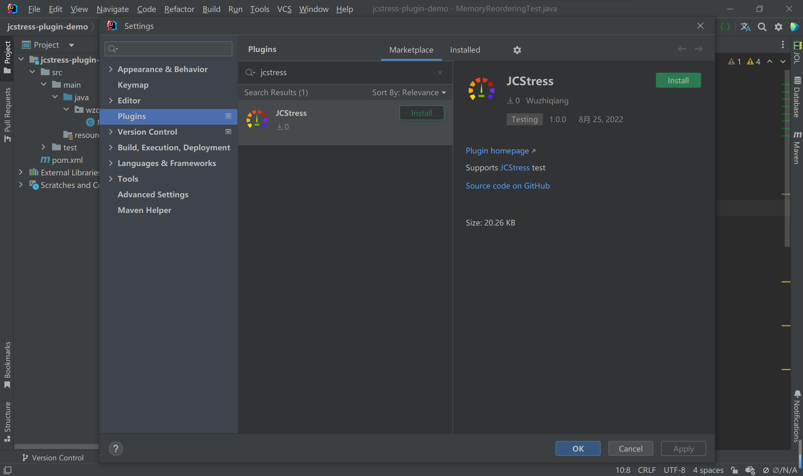
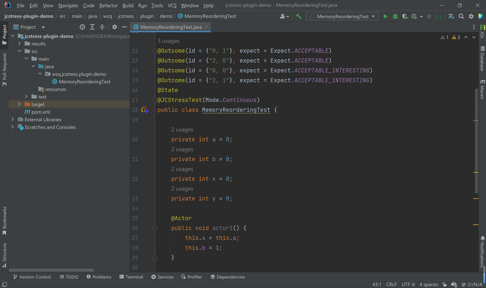

    

# Intellij IDEA plugin for Java Concurrency Stress

    

## Usage

## Language

## CI/CD

## Related projects

- [JCStress](https://github.com/openjdk/jcstress)

## License

[MIT](./LICENSE)